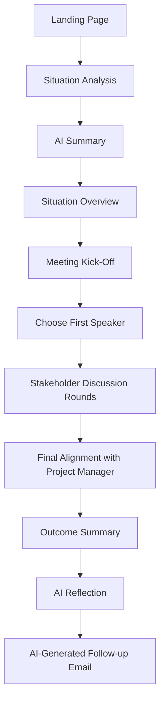

# The Critical Meeting - AI-Augmented BA Simulation

An interactive single-page simulation that demonstrates how a Business Analyst can use AI to prepare for and facilitate a high-stakes project meeting with conflicting stakeholder priorities.

## Overview

The Critical Meeting is a lightweight, front-end-only simulation designed to help users experience a realistic BA workflow in a delivery-focused environment. The experience combines:

- AI-assisted pre-meeting analysis
- BA-led meeting facilitation
- Stakeholder trade-off management
- AI-generated meeting notes
- Outcome scoring and reflection
- AI-drafted follow-up communication

The simulation is intentionally designed to show that AI supports analysis, structure, and admin efficiency, while the Business Analyst still owns judgement, facilitation, and decision framing.

## Product Purpose

Business Analysts are often expected to navigate high-pressure project conversations where delivery commitments, technical risk, quality concerns, and stakeholder expectations all compete at once.

This simulation exists to help users:

- understand how a BA prepares before a critical meeting
- practice leading a structured discussion
- experience conflicting stakeholder priorities
- see how AI can support BA workflows without replacing BA judgement

## Value Proposition

- Demonstrates AI-augmented BA workflows in a realistic format
- Simulates real stakeholder dynamics and delivery pressure
- Reinforces structured meeting leadership, not passive note-taking
- Provides reflective feedback after the decision is made

## Problem Statement

Business Analysts often:

- struggle to handle conflicting stakeholder priorities
- lack confidence in leading meetings effectively
- are unsure how to use AI in practical day-to-day workflows

There is currently no simple, interactive way to experience a realistic project meeting while learning how AI can support BA preparation, facilitation, note-taking, and follow-up.

## Target Persona

**Sarah Chen - Business Analyst**

Sarah works in delivery-focused teams and wants to improve how she facilitates project conversations under pressure. She is interested in using AI to make her work faster and more effective, especially when preparing for meetings, synthesising messy information, and communicating outcomes clearly.

## Core Experience

The user steps into the role of the Business Analyst and moves through a full decision-making workflow:

1. Review scattered project inputs before the meeting
2. Use simulated AI to summarise the key issues
3. Enter the meeting as the BA host
4. Open the meeting and frame the problem
5. Decide who should speak first
6. Respond to stakeholder concerns and manage trade-offs
7. Make a final recommendation with the Project Manager
8. Review the meeting outcome, AI reflection, and follow-up email

## User Journey



## In Scope

- AI-assisted pre-meeting analysis
- Meeting facilitation led by the Business Analyst
- Stakeholder interaction across Product Owner, Tech Lead, Tester, and Project Manager
- Decision-making with business, delivery, and technical trade-offs
- AI-generated notes during the meeting
- AI-generated follow-up email after the meeting
- Outcome scoring across trust, risk, and business impact

## Out of Scope

- Real AI or LLM integration
- Voice interaction
- Free movement in 3D space
- Multi-meeting scenarios in the MVP
- Backend database
- External data storage

## Functional Requirements

### FR-01: Landing Page

The landing page introduces the simulation, highlights the AI-supported workflow, and allows the user to enter their name and start the experience.

Acceptance intent:

- The title **The Critical Meeting** is visible on load
- AI features are clearly highlighted
- The user can enter their name
- Clicking **Begin Mission** moves the user to the scenario analysis screen

### FR-02: AI-Assisted Scenario Analysis

The user reviews multiple source inputs before the meeting and uses AI to summarise the situation.

Acceptance intent:

- Defect report, team chat, and stakeholder email sources are displayed
- Clicking **Use AI to Summarise** reveals:
  - 3 high severity defects identified
  - 2 may impact existing customers
  - Delivery commitment has already been communicated
- The user can proceed to the situation narrative

### FR-03: Scenario Narrative

The narrative provides context before the user enters the meeting room.

Acceptance intent:

- The context includes:
  - feature release in one week
  - identified defects
  - potential customer impact
  - need for a decision
- Clicking **Enter Meeting Room** takes the user into the meeting experience

### FR-04: Meeting Kick-Off

The user leads the meeting as the BA and is responsible for setting tone and structure.

Acceptance intent:

- The meeting room confirms that all stakeholders have joined
- The user chooses how to open the meeting
- Stakeholder reactions are updated based on the selected approach
- The problem definition and expected outcome are recorded through user choices

### FR-05: Speaker Selection

The user chooses who speaks first to guide the flow of the conversation.

Acceptance intent:

- Only Tester, Tech Lead, and Product Owner are selectable first speakers
- Helper text reminds the user that final alignment with the Project Manager happens later
- The selected stakeholder begins the next discussion round

### FR-06: Stakeholder Interaction

Each stakeholder presents concerns and the user chooses one of three responses.

Acceptance intent:

- Dialogue is displayed for the active stakeholder
- Three response options are presented
- Reactions and internal scoring update after each choice

### FR-07: AI Assist During Meeting

AI Assist is available during the meeting to support the user with guidance.

Acceptance intent:

- Clicking **AI Assist** shows a suggested approach
- The user remains free to choose any available option

### FR-08: AI Meeting Notes

AI notes update live as the meeting progresses.

Acceptance intent:

- Notes capture key points per stakeholder
- Draft actions are added as the conversation moves forward

### FR-09: Final Decision

The Project Manager asks for a final recommendation once all discussion rounds are complete.

Acceptance intent:

- The user chooses one final recommendation:
  - Proceed with release
  - Delay release
  - Partial release
- The simulation calculates the outcome after confirmation

### FR-10: Outcome and AI Reflection

The simulation ends with outcome scoring and reflective feedback.

Acceptance intent:

- Stakeholder Trust is displayed
- System Risk is displayed
- Business Impact is displayed
- AI reflection highlights strengths and improvement areas

### FR-11: AI Email Generation

The experience closes with an AI-drafted follow-up email.

Acceptance intent:

- The email includes:
  - meeting summary
  - decision made
  - action list
- The action list includes:
  - Tech team to provide daily status updates on defect resolution

## Detailed UX Screen Flow

### 1. Landing Page

**Purpose**

Hook the user quickly, explain the simulation, and make AI support feel central from the first screen.

**Key content**

- Title: **The Critical Meeting**
- Subtitle explaining the BA + AI simulation concept
- Three AI highlight cards:
  - AI-assisted issue analysis
  - AI-generated meeting notes
  - AI-drafted follow-up email
- Name entry field
- Primary CTA: **Begin Mission**
- Optional animated AI preview panel

**Desired feeling**

"This is not just a game. This is a future BA simulation with AI support."

### 2. AI-Assisted Scenario Analysis

**Purpose**

Show how a BA prepares before the meeting by reviewing scattered inputs and using AI to synthesise them.

**Key content**

- Header: **Situation Analysis**
- Intro text about reviewing multiple sources
- Three source cards:
  - Defect Report
  - Team Chat
  - Stakeholder Emails
- Button: **Use AI to Summarise**
- AI summary panel
- Situation Overview narrative
- CTA: **Enter Meeting Room**

**Exact AI summary output**

- 3 high severity defects identified
- 2 may impact existing customers
- Delivery commitment has already been communicated

### 3. Situation Overview

**Purpose**

Prepare the user mentally for the upcoming meeting.

**Narrative themes**

- The feature is due to go live in one week
- Critical defects have been identified
- Existing customers may be affected
- The team needs a decision

### 4. Meeting Kick-Off

**Purpose**

Position the user as the BA host and allow them to set the tone for the discussion.

**Meeting setup**

- All stakeholders have joined the meeting
- The BA is the host
- The room includes:
  - Product Owner
  - Tech Lead
  - Tester
  - Project Manager

**User decisions**

- How to open the meeting
- How to frame the problem
- What outcome the meeting should achieve

**UX polish**

- Live stakeholder reactions
- Meeting tension indicator
- AI assistant sidebar
- Speaker highlight states

### 5. Speaker Selection

**Purpose**

Give the user control over the order of discussion and reinforce intentional facilitation.

**Selectable speakers**

- Tester
- Tech Lead
- Product Owner

**Helper copy**

"You will align on the final decision with the Project Manager later in the meeting."

### 6. Stakeholder Discussion Round 1

**Purpose**

Begin the core dialogue and introduce a meaningful project risk.

**Example stakeholder**

Tester

**Themes raised**

- 3 unresolved high-severity defects
- 2 defects may impact existing customers

**Player interaction**

- Choose one of three BA responses
- Use AI Assist if needed
- See AI meeting notes update live

### 7. Stakeholder Discussion Round 2

**Purpose**

Introduce delivery pressure through the Product Owner.

**Themes raised**

- Release timing has already been communicated
- Delay creates business impact and stakeholder concern

**Player challenge**

Balance stability and customer impact against delivery commitment.

### 8. Stakeholder Discussion Round 3

**Purpose**

Surface technical and production risk through the Tech Lead.

**Themes raised**

- Releasing now could create avoidable risk
- Existing users may be impacted in production
- Follow-up incidents are possible

**Player challenge**

Clarify worst-case outcomes and mitigation before making the final recommendation.

### 9. Final Alignment with Project Manager

**Purpose**

Bring the meeting to a clear decision point.

**Prompt**

The Project Manager asks for a final recommendation based on everything discussed.

**Final decision options**

- Proceed with release as planned
- Delay the release
- Proceed with a partial or controlled release

**Decision framing**

The user is reminded that the recommendation affects stakeholder trust, system risk, and business impact.

### 10. Outcome Summary

**Purpose**

Make the experience reflective rather than simply right or wrong.

**Score areas**

- Stakeholder Trust
- System Risk
- Business Impact

**Outcome messaging**

The summary explains how well the user balanced perspectives, structured the conversation, and managed risk versus delivery pressure.

### 11. AI Reflection

**Purpose**

Reinforce learning by showing how AI can support post-meeting reflection.

**Example reflection themes**

Strengths:

- structured meeting facilitation
- clear stakeholder management
- balanced decision framing

Improvement opportunities:

- surface risk earlier
- drive alignment sooner
- translate discussion into actions more quickly

### 12. AI-Generated Follow-up Email

**Purpose**

Close the loop by showing how AI can save time after the meeting.

**Included content**

- Subject line
- Summary of the discussion
- Final decision
- Action list for Tech, Product, and Project Management stakeholders

## Design Intent

This experience is designed to leave the user with three core messages:

1. A Business Analyst does more than take notes. A BA leads structured discussion.
2. AI helps reduce admin and synthesise information, but the BA still owns judgement.
3. Project meetings are about balancing trade-offs, not finding a perfect answer.

## Non-Functional Requirements

### Performance

- Page transitions should feel fast and lightweight
- Interaction response should feel immediate

### Usability

- The UI should be intuitive with no training required
- Options should be easy to read and click
- Text should remain concise and business-friendly

### Accessibility

- Readable typography across desktop and laptop
- Buttons large enough for comfortable interaction
- Sufficient colour contrast

### Compatibility

- Desktop-first experience
- Responsive mobile layout

### Maintainability

- Structured into:
  - `index.html`
  - `style.css`
  - `script.js`
- Modular logic for easier updates

### Scalability

The design should support future expansion such as:

- additional scenarios
- more stakeholders
- real AI integration later

### Security

- No backend required
- No external user data storage

## Success Metrics

- Users complete the full simulation
- Users replay the experience
- Users respond positively to the realism
- The project supports engagement and sharing on LinkedIn

## Current Implementation

This repository currently contains a front-end-only MVP implemented with plain HTML, CSS, and JavaScript.

### Tech Stack

- HTML
- CSS
- Vanilla JavaScript
- Local image assets only
- No backend
- No package manager or automated test tooling currently kept in the repo

### Project Structure

```text
.
├── Astronaut in high-tech space cockpit.png
├── Meeting room background.png
├── Meeting room page UX design.png
├── Product Owner.png
├── Project Manager.png
├── Tech Lead.png
├── Tester.png
├── assets/
│   ├── product-owner-placeholder.svg
│   ├── project-manager-placeholder.svg
│   ├── tech-lead-placeholder.svg
│   └── tester-placeholder.svg
├── README.md
├── index.html
├── script.js
└── style.css
```

### Image Assets

The repo currently contains both:

- PNG stakeholder portraits used in the meeting room
- SVG placeholder stakeholder images kept as fallback assets
- A local astronaut hero image for the landing page
- A local meeting room background image for Phase 4

## Agent Handoff

This section is the source of truth for the next agent. The PRD-style sections above capture the original baseline; where the current build differs, follow the guidance below.

### Product Direction To Preserve

- The experience uses a mission-control / spaceship metaphor, but it should stay professional and not feel like a cartoon game.
- The BA is positioned as the human decision-maker. AI is supportive, not the main actor.
- The user strongly prefers immersive, cinematic UI over dashboard-like UI.
- The user is highly visual and often iterates by screenshot. Small layout, brightness, and overlap issues matter.

### Current Build Snapshot

- Landing page CTA is **Begin Mission**.
- The landing page uses `Astronaut in high-tech space cockpit.png` as the hero image.
- The landing page right panel is **System Intelligence**.
- Signal Analysis requires the user to review all 3 source cards before **Use AI to Summarise** unlocks.
- Source cards stay open after they are clicked.
- Team Chat uses simple rounded left/right bubbles with no tails.
- Signal Analysis intro is personalised:
  - blank name: `Please review the signals before making a decision.`
  - entered name: `{Name}, please review the signals before making a decision.`
- AI Summary uses a progressive reveal flow:
  - `Reveal insight`
  - then staged `Continue` actions
  - `View Source` shows inline reference text instead of visible source chips
- The AI Summary CTA into Phase 4 is **Enter the Meeting**.
- The Meeting Room uses `Meeting room background.png`.
- Meeting stakeholder order is fixed left-to-right:
  - Tester
  - Product Owner
  - Project Manager
  - Tech Lead
- The old `You / Host` card was intentionally removed.

### Important User Decisions

- Keep `AI-AUGMENTED BA SIMULATION` in the original accent color `#7FE7DC` wherever it appears.
- Keep the main title bright and high-contrast. Do not use dim opacity, gradient text, or blend effects on the title.
- Avoid overlapping UI. The user repeatedly calls out collisions between badges, buttons, mood pills, cards, and background imagery.
- AI Assist should feel secondary and optional, not louder than the main conversation.
- AI Meeting Notes should stay supportive and lightweight.
- The meeting should feel less like a quiz and more like a live conversation.
- The user prefers manual testing and explicitly asked not to keep automated test scaffolding in the repo.

### Known Sensitive Areas

- Meeting-room hero brightness and readability have been revised multiple times. If this area changes again, review it visually.
- The meeting-room top scene is sensitive to text overlap and clipping.
- Stakeholder mood pills should sit cleanly below the cards and not cut across avatars or card borders.
- If older meeting copy such as `Everyone is looking at you to begin.` reappears in a visually dominant way, treat that as likely unwanted unless the user explicitly asks for it.

### File Ownership Guide

- `index.html`: screen structure, copy, buttons, panel order
- `style.css`: layout, spacing, brightness, overlap fixes, visual hierarchy
- `script.js`: phase transitions, gating logic, summary reveal flow, meeting interaction state

### Do Not Reintroduce Unless Asked

- Playwright
- axe-core
- `package.json` / `package-lock.json`
- test scaffolding or automated verification setup

## How to Run Locally

Because this is a static front-end project, you can run it locally in any browser.

### Option 1: Open directly

Open `index.html` in your browser.

### Option 2: Serve locally

Use any lightweight local server, for example:

```bash
python3 -m http.server
```

Then open the local address shown in your terminal.

## Future Enhancements

Potential next steps for future versions:

- replace simulated AI outputs with real OpenAI integration
- add multiple meeting scenarios
- add branching stakeholder personalities
- introduce analytics or replay summaries
- persist results locally
- add voice or guided narration in a later phase

## Summary

The Critical Meeting is a practical, simulation-based learning experience that shows how a Business Analyst can use AI before, during, and after a high-stakes project meeting. It combines preparation, facilitation, decision-making, reflection, and follow-up into a single end-to-end workflow designed for realism, clarity, and learning value.
